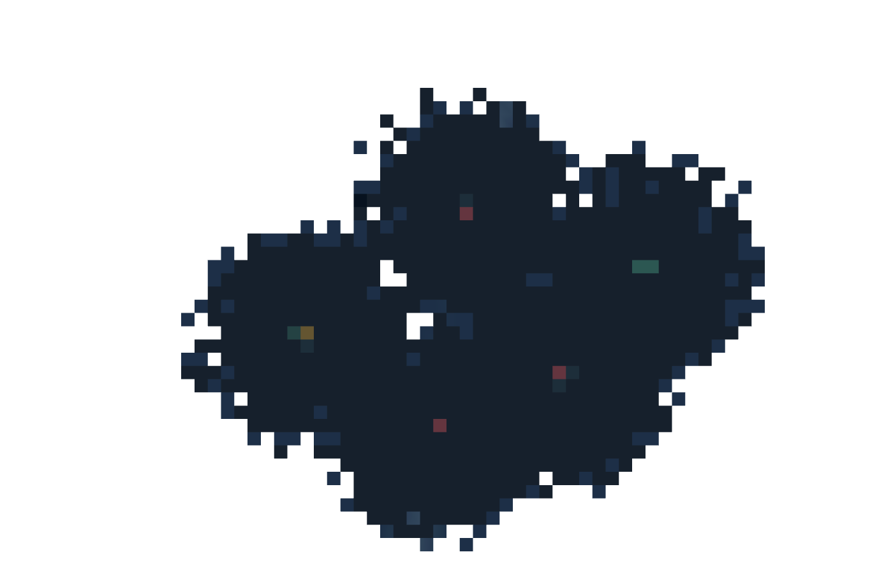
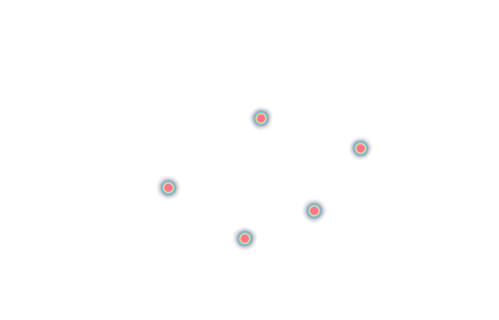
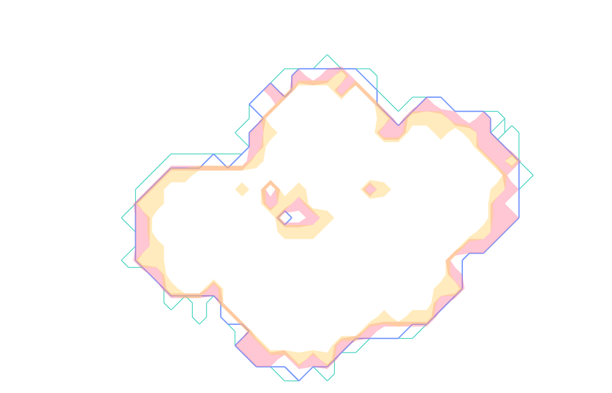
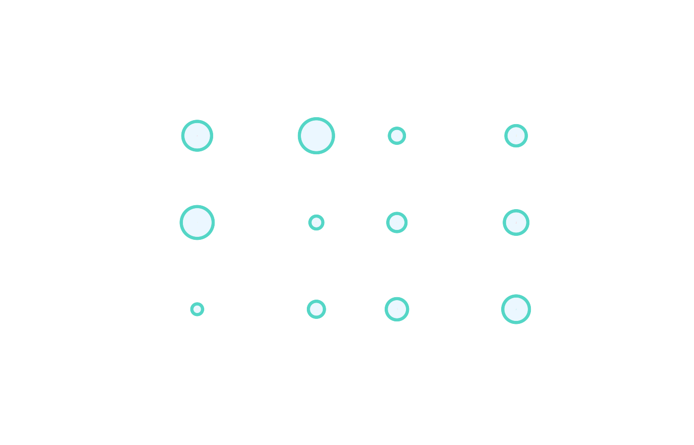
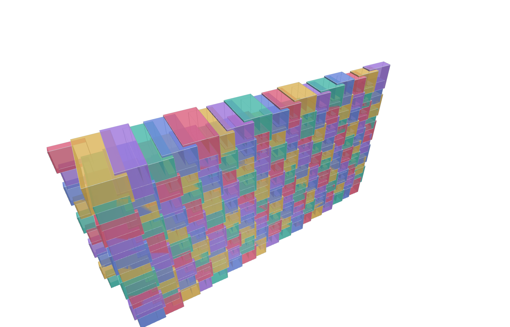
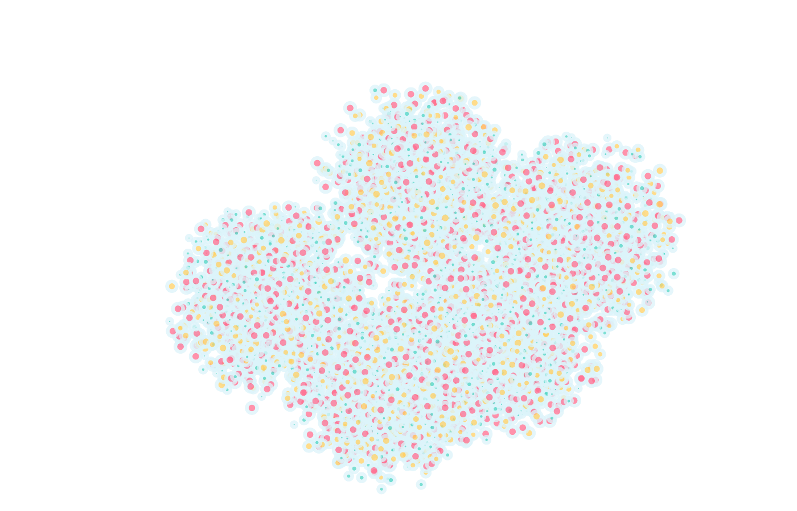
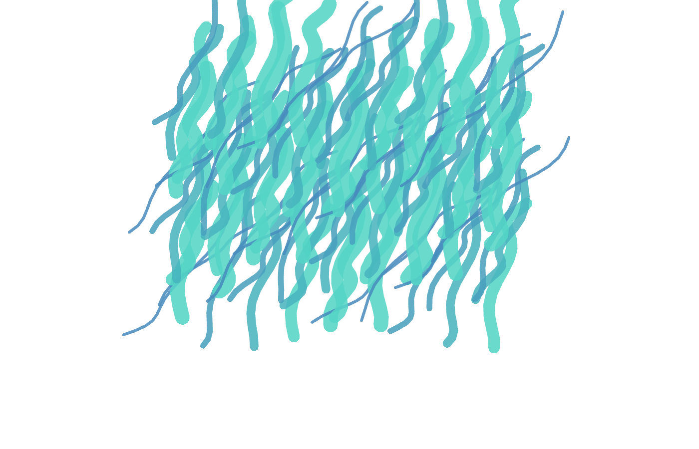
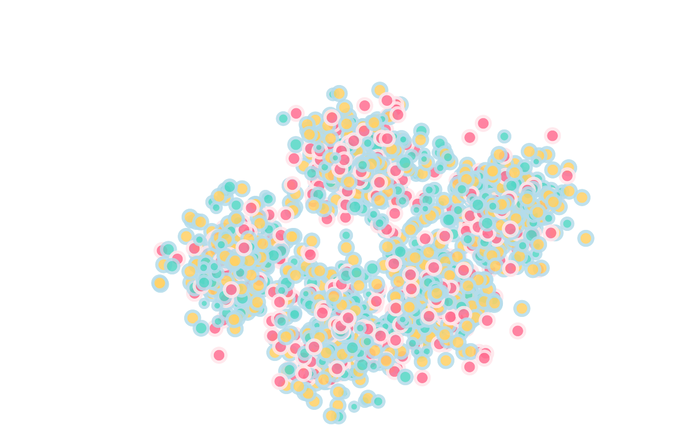
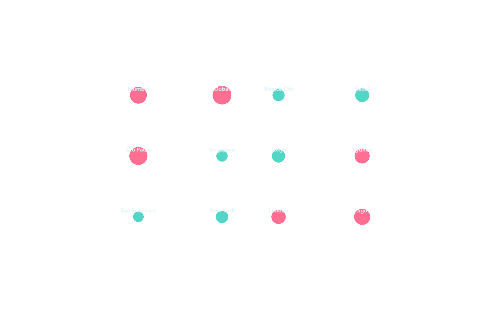

# deckgl-examples

Twelve self-contained deck.gl reference scenes spanning GPU aggregation, animated trajectories, geographic flows, contours, parcels, labels, and point fields without a basemap or runtime network dependency.

```bash
npm install
npm run build && npm run render
npm test
```

`npm test` type-checks, builds the Vite application, launches the built site in system Chrome, exercises each canvas, blocks external requests, checks browser errors, and writes both styled previews and background-transparent PNG exports to `out/`. The validator checks alpha coverage and visible drawing pixels in every transparent export.

The datasets are deterministic synthetic fixtures intended to expose rendering techniques, not observations from real cities.

## Transparent PNG reference gallery

`catalog.json` records the use case, question, visual family, complexity, and tags for every scene.

| Hexagons | Trips | Flows | Grid cells |
|---|---|---|---|
|  |  |  |  |
| Heat islands | Pressure contours | Migration arcs | Parcel zoning |
|  |  |  |  |
| Constellation | River network | Sensor field | Label atlas |
|  |  |  |  |
