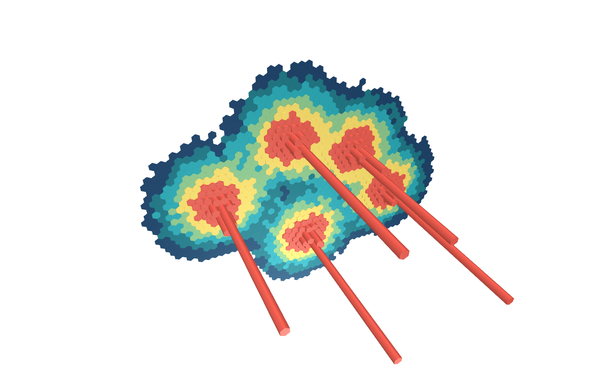
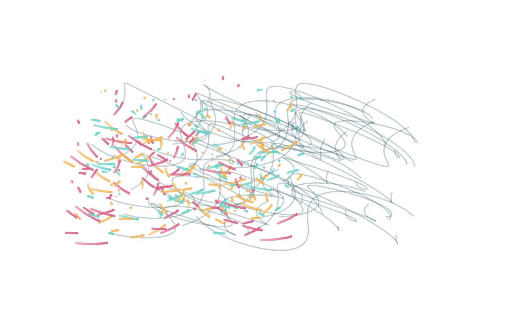
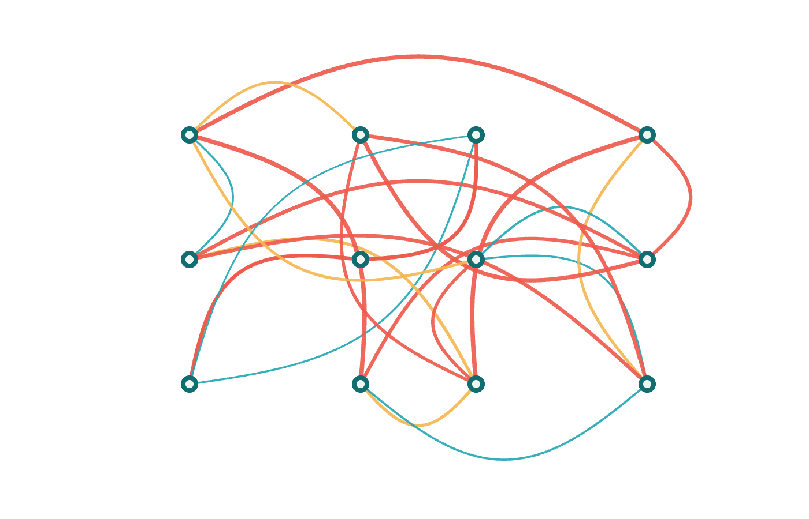

# deckgl-examples

Three self-contained deck.gl scenes that demonstrate GPU aggregation, animated trajectories, and geographic flow arcs without a basemap or runtime network dependency.

```bash
npm install
npm run build && npm run render
npm test
```

`npm test` type-checks, builds the Vite application, launches the built site in system Chrome, exercises each canvas, blocks external requests, checks browser errors, and writes both styled previews and background-transparent PNG exports to `out/`. The validator checks alpha coverage and visible drawing pixels in every transparent export.

The datasets are deterministic synthetic fixtures intended to expose rendering techniques, not observations from real cities.

## Transparent PNG gallery

| GPU hexagons | Animated trips | Curved flows |
|---|---|---|
|  |  |  |
